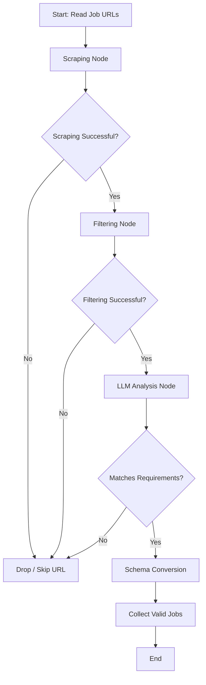

# Dawrly a Crew of Ai agents

- Dawrly is a mutli agent system designed to automate the job hunting process. (so yeah boy no need to spend a lot of time again on linkedin or indeedd , etc..)

- As you probably know, the current tech job market is pretty tough. After studying **MAS (Multi-Agent Systems)**, I got the idea to build **Dawrly**, an AI job hunter that automates the entire process for us.


## if you still got any question the project
- you can check the deep wiki docs for this project and chat with Mr Devin here about it
  - [](https://deepwiki.com/ZiadWaleed2003/Dawrly-Crew-of-AI-Agents)

- or speak to me I'd be more than happy to help
  - <a href=https://www.linkedin.com/in/ziadwaleed target="_blank">Linkedin</a>
  - ziadwaleedmohamed2003@gmail.com


## How Does it works ? 

- check this Demo and the Following diagrams


## 🎥 Demo Video (Click on the thumbnail)


[](https://youtu.be/N5mV3jW-rpY?si=I30H3dSvY71R8vGF)


### Diagrams 


### Agent Number 3 (Job scrutinizer) workflow in details:

- Cause it's a custom LangGraph workflow while the other 2 agents are built using CrewAI


<details>
<summary>Click to view the diagram</summary>


</details>

        
## How to use it ?

#### you have got two ways to try it out :

  1. the demo while it's live <a href=https://dawrly-crew.netlify.app target="_blank">Click Me</a>

  2. you can use it locally on your own device


## For Local Installation 💻

<details>
  <summary>The Docker Compose Way 🐳</summary>

- This method allows you to run Dawrly and its dependencies using Docker containers, providing an isolated and consistent environment.

---

1.  **Clone the Repository:**

    First, you need to clone the project repository:

    ```bash
    git clone https://github.com/ZiadWaleed2003/Dawrly-Crew-of-AI-Agents.git
    cd Dawrly-Crew-of-AI-Agents
    ```

2.  **Ensure Docker and Docker Compose are Installed:**

    Make sure you have Docker and Docker compose locally

3.  **Configure Environment Variables:**

    Both the `backend` and `frontend` directories require a `.env` file for configuration.
    * **Create `.env` files:**
        Navigate into the `backend` directory and create a file named `.env`:
        ```bash
        cd backend
        touch .env
        ```
        Then, do the same for the `frontend` directory:
        ```bash
        cd ../frontend
        touch .env
        cd .. # Go back to the main project directory
        ```

    * **Populate `.env` files:**
        Open the newly created `.env` files in your text editor and add the required environment variables based on their respective `.env.example` files.

        *Example: `backend/.env.example`*
        ```ini
        AGENTOPS_API_KEY=your-api-key
        TAVILY_API_KEY=your-api-key
        FIRECRAWL_API_KEY=your-api-key
        CEREBRAS_API_KEY=your-api-key
        NVIDIA_API_KEY=your-api-key
        GEMINI_API_KEY=your-api-key
        GROQ_API_KEY=your-api-key
        LANGSMITH_API_KEY=your-api-key
        LANGSMITH_TRACING=true
        LANGSMITH_PROJECT=anyname-you-want
        EMAIL=email to use when sending the results
        EMAIL_PASSWORD= I guess this one is obvious
        ```
        *Example: `frontend/.env.example`*
        ```ini
        # Example variables for the frontend
        VITE_BACKEND_URL=http://localhost:8000
        ```


4. **How to get the API keys ?**
     - unfortunately while developing this app I used alot of services but the good news it's all free and you can get the API keys too :
     - <a href=https://build.nvidia.com/models target="_blank">Nvidia NIM</a>
     - <a href=https://www.agentops.ai/ target="_blank">Agentops</a>
     - <a href=https://www.tavily.com/ target="_blank">Tavily</a>
     - <a href=FIRECRAWL_API_KEY target="_blank">FireCrawl</a>
     - <a href=https://www.cerebras.ai/ target="_blank">Cerebras</a>
     - <a href=https://aistudio.google.com/app/api-keys target="_blank">Gemini API</a>
     - <a href=https://groq.com/ target="_blank">Groq</a>
     - <a href=https://smith.langchain.com/ target="_blank">LangSmith</a>
     - Email --> you need to create a new google account and use it here for the app to be able to send you the results on your perosnal email
     - Email Password --> you will also need to get it from google
  
    **add these to the .env file in the backend and you are good to go**
     

5.  **Run with Docker Compose:**

    Once Docker is installed and your `.env` files are configured, navigate to the main project directory (where your `docker-compose.yml` file is located) and run the following command:

    ```bash
    docker compose up --build
    ```
    This command will:
    * **`up`**: Start all services defined in  `docker-compose.yml`.
    * **`--build`**: Rebuild images if there are any changes in  `Dockerfiles` or context.

    After the services are up and running, you should be able to access the frontend of Dawrly in your web browser, at `http://localhost:3000` (make sure to kill any process running on port 3000 or 8000).
</details>


## What ? did u expect me to provide a `pip install` method ?
  - I'm going to hold your hands when I say this (ma man you need to learn how to use **Docker** it's 2025 and you are still drowning in dependency conflicts)
  
  

6. **I almost forgot ... for monitoring I used LangSmith and AgentOps**

- Don't worry there is nothing more u need to do just add the env vars and you are good to go you will find the logs on LangSmith website and AgentOps
